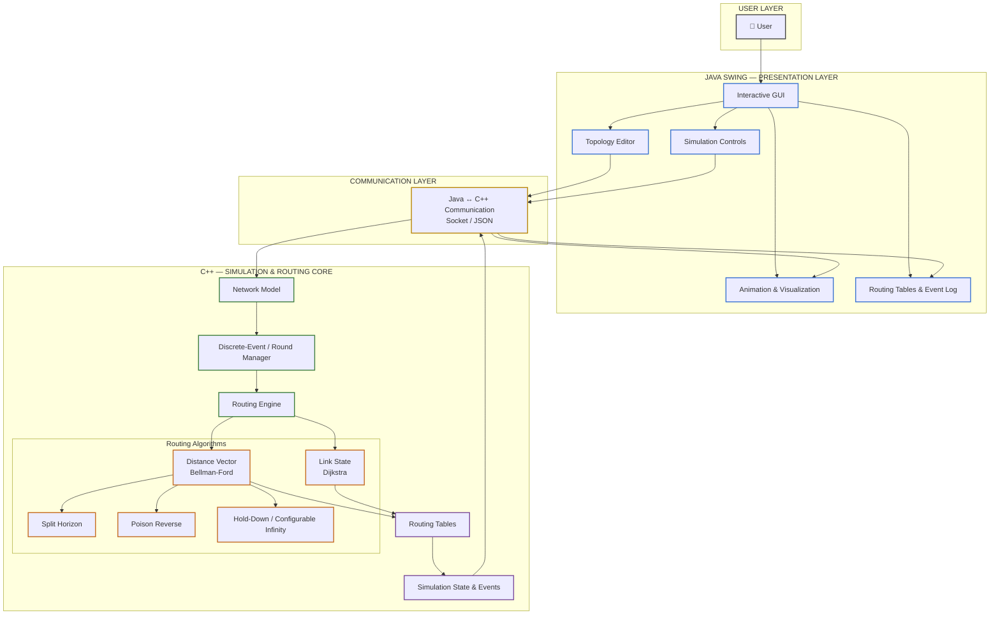

# Project Structure and Architecture

## 1. Project Structure

```text
distance-vector-simulator/
│
├── backend/                         # C++ simulation and routing core
│   ├── src/
│   └── Makefile
│
├── gui/                             # Java Swing GUI
│   └── src/
├── tests/                           # Automated and integration tests
│   ├── unit/
│   ├── integration/
│   └── test_cases/
│
├── examples/                        # Sample topologies and scenarios
│   ├── basic/
│   ├── loop/
│   ├── count-to-infinity/
│   ├── failure/
│   └── link-state/
│
├── docs/                            # Project documentation
│   ├── project-overview.md
│   ├── algorithm.md
│   ├── design.md
│   └── experiments.md
│
├── learning/                        # Learning and reference notes
│   ├── git.md
│   ├── networking.md
│   ├── distance-vector.md
│   └── cpp.md
│
├── README.md
├── Makefile
└── .gitignore
```

---

## 2. System Architecture

The simulator follows a **two-layer architecture** consisting of a Java Swing presentation layer and a C++ simulation and routing core.

```mermaid
flowchart TD
    U[User]

    GUI["Java Swing GUI<br/>Topology & Controls"]
    
    IPC["Java ↔ C++ Communication<br/>Socket / JSON"]
    
    CORE["C++ Core Backend"]

    NM["Network Model"]
    EM["Event Manager"]
    RA["Routing Algorithms"]

    DV["Distance Vector<br/>Bellman-Ford"]
    LS["Link State<br/>Dijkstra"]

    RT["Routing Tables"]
    SE["Simulation Events<br/>& State Changes"]

    VIZ["Java Swing Visualization<br/>Animation & Results"]

    U --> GUI

    GUI -->|"Topology / Commands"| IPC
    IPC --> CORE

    CORE --> NM
    NM --> EM
    EM --> RA

    RA --> DV
    RA --> LS

    DV --> RT
    LS --> RT

    RT --> SE
    SE -->|"State / Events"| IPC
    IPC --> VIZ

    VIZ --> U

    classDef user fill:#000000,stroke:#333,stroke-width:2px;
    classDef java fill:#000000,stroke:#356ae6,stroke-width:2px;
    classDef cpp fill:#000000,stroke:#3c7a3c,stroke-width:2px;
    classDef algo fill:#000000,stroke:#c47b00,stroke-width:2px;
    classDef output fill:#000000,stroke:#7a3e9d,stroke-width:2px;

    class U user;
    class GUI,IPC,VIZ java;
    class CORE,NM,EM cpp;
    class RA,DV,LS algo;
    class RT,SE output;
```




##layered architecture



---

## 3. Architecture Components

### 3.1 Java Swing Presentation Layer

The Java Swing layer is responsible for all user interaction and visualization.

It provides:

* Interactive network topology creation
* Adding and removing routers
* Adding and removing links
* Setting and changing link costs
* Starting, pausing, resetting, and stepping through simulation rounds
* Simulation speed control
* Animated routing-message visualization
* Dynamic routing-table display
* Event and message log
* Convergence-status display

The Java GUI does **not** perform the core routing calculations.

---

### 3.2 Communication Layer

The Java GUI communicates with the C++ backend through a communication layer.

The communication layer transfers:

* Topology information
* Router and link operations
* Simulation commands
* Routing-table states
* Simulation events
* Message/update information
* Convergence status

The communication mechanism will use **Java Socket / JSON-based communication**.

---

### 3.3 C++ Simulation and Routing Core

The C++ backend contains the complete routing and simulation logic.

It is responsible for:

* Maintaining the network model
* Managing routers and links
* Managing link costs and failures
* Processing simulation rounds/events
* Maintaining routing tables
* Running routing algorithms
* Detecting convergence
* Generating routing updates
* Handling routing changes and failures

The core algorithms will be implemented **from scratch** without using graph, routing, or network-simulation libraries.

---

### 3.4 Routing Algorithms

The backend will support the following routing modes:

#### Distance Vector — Bellman-Ford

The main routing algorithm will implement Distance Vector routing using the **Bellman-Ford algorithm from scratch**.

It will support:

* Periodic updates
* Triggered updates
* Routing-table updates
* Link failure and restoration
* Routing loops
* Count-to-infinity behavior
* Convergence detection

#### Distance Vector Extensions

The simulator will also support:

* Split Horizon
* Poison Reverse
* Hold-Down
* Configurable Infinity

These modes will allow different Distance Vector behaviors to be demonstrated and compared.

#### Link State — Dijkstra

The simulator will additionally implement **Link State Routing using Dijkstra's algorithm** for comparison with Distance Vector routing.

---

## 4. Simulation Flow

The overall execution flow is:

```text
User
  │
  ▼
Java Swing GUI
  │
  ├── Create / Modify Topology
  ├── Select Routing Mode
  ├── Start / Pause / Reset
  └── Next Round
  │
  ▼
Java ↔ C++ Communication
  │
  ▼
C++ Network Model
  │
  ▼
Event / Round Manager
  │
  ▼
Routing Engine
  │
  ├── Distance Vector → Bellman-Ford
  │
  └── Link State → Dijkstra
  │
  ▼
Routing Tables
  │
  ▼
Simulation Events / State Changes
  │
  ▼
Java Swing GUI
  │
  ├── Animate Messages
  ├── Update Routing Tables
  ├── Update Event Log
  └── Display Convergence Status
```

---

## 5. Example Simulation Scenario

For example, consider the following topology:

```text
        2
   A -------- B
               \
                \ 3
                 \
                  C
```

Initially, each router knows its directly connected neighbors.

During the simulation:

1. The C++ backend initializes the routing tables.
2. Routers exchange Distance Vector updates.
3. Bellman-Ford calculates improved routes.
4. Routing tables are updated.
5. The backend generates simulation events.
6. The events are sent to the Java GUI.
7. The GUI animates the routing messages.
8. The corresponding routing-table rows are highlighted and updated.
9. The process continues until no routing-table changes occur.
10. The simulator reports the network as **converged**.

---

## 6. Link Failure Flow

If a link fails during simulation:

```text
Before Failure:

A ───── 2 ───── B ───── 3 ───── C
```

The user selects **Fail Link** from the GUI.

```text
After Failure:

A ───── 2 ───── B     X     C
```

The GUI sends the link-failure event to the C++ backend.

The C++ backend then:

1. Updates the network model.
2. Detects affected routes.
3. Generates triggered routing updates.
4. Recalculates routing tables.
5. Processes subsequent simulation rounds.
6. Detects convergence after the routing tables stabilize.

The resulting state and events are sent back to the Java GUI for visualization.

---

## 7. Design Principle

The main design principle is to keep **routing logic and visualization separate**.

```text
C++ Backend
    │
    │ Routing & Simulation
    │
    ▼
State / Events
    │
    ▼
Java Swing
    │
    │ Visualization
    ▼
User
```

Therefore:

* **C++** handles the complete routing and discrete-event simulation core.
* **Java Swing** handles user interaction, visualization, animation, and presentation.
* **Communication layer** connects the backend and GUI.
* **No graph, routing, or network-simulation library** will be used for the core implementation.
